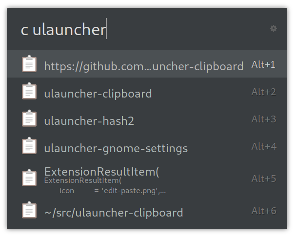

# ulauncher-clipboard

[Ulauncher](https://ulauncher.io) extension for managing your clipboard history



## Usage

Open Ulauncher and type the keyword `c` followed by a space. This will search your clipboard history. Activate an entry (for example by pressing enter or clicking on it). This will copy it your actual clipboard. Now you can paste it elsewhere.

From Ulauncher's preferences you can change the keyword and the clipboard manager to use, number of results to be shown.

If you want to use [GPaste](https://github.com/Keruspe/GPaste/) or [CopyQ](https://github.com/hluk/CopyQ) or [Clipman](https://github.com/yory8/clipman), you have to install them. Unlike the other options [Clipster](https://github.com/mrichar1/clipster) will be downloaded automatically and is used as the fallback in "Auto" mode if you don't have any of the others.

### Copy hook

ulauncher-clipboard supports a *hook* to run after activating an entry in the list and copying it to the clipboard. This is an indirect way to support pasting. It's not possible to achieve pasting safely, but depending on your system environment you may be able to run a command to trigger "ctrl+v" or "shift+insert". This will not work in all applications, and may even have unwanted side effects, so beware!

In X11 you can use xdotool to do this. Ex:

```sh
xdotool key ctrl+v
```

## License

The code is licensed as MIT.

ulauncher-clipboard will try to use your icon theme.
The fallback icons (also used in the screenshot) are part of [Paper Icons](http://snwh.org/paper/icons) by [Sam Hewitt](http://samuelhewitt.com/), and is licensed under [CC-SA-4.0](http://creativecommons.org/licenses/by-sa/4.0/)
